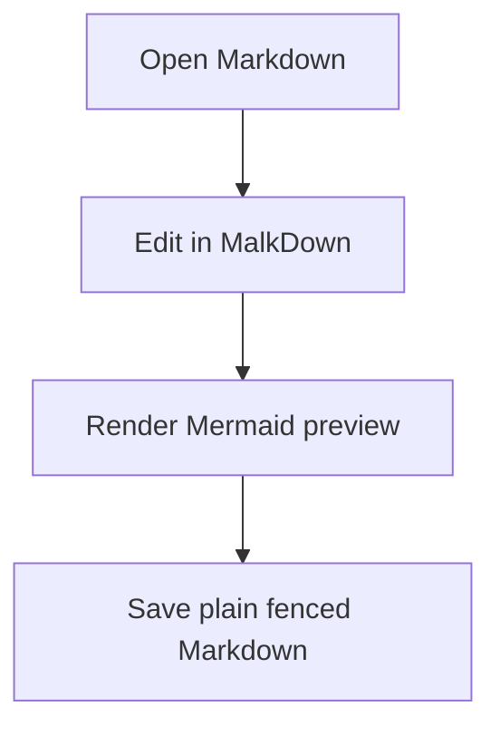

# MalkDown Editor Showcase

This is the source-of-truth smoke document for MalkDown Editor. Keep this file and `tests/fixtures/test.md` in sync.

Last updated: 2026-05-23 15:44

## 1. WYSIWYG Editing

Type normal Markdown here and switch between raw Markdown and MalkDown Editor.

Use the `MalkDown Editor` title-bar button to toggle between views.

## 2. Text Formatting

Select text to open the floating toolbar.

- **Bold text**
- *Italic text*
- ~~Strikethrough text~~
- `Inline code`
- [Milkdown](https://milkdown.dev/) link tooltip with copy, edit, and red remove action

> Select a paragraph and use the floating toolbar Quote button to wrap it as a blockquote.

Select a paragraph and use the floating toolbar Code Block button to convert it to a fenced code block.

## 3. Date & Time Tools

Use the slash menu or command palette to insert and update timestamps.

Default settings:

- Date format: `yyyy-MM-dd`
- Time format: `HH:mm`
- Last updated template: `Last updated: {date} {time}`
- History entry template: `- {date} {time} - `
- Custom template: `{date} {time}`
- Inline slash shortcuts: enabled

Visible examples:

- Today's date: 2026-05-18
- Current time: 16:04
- Date and time: 2026-05-18 16:04
- Custom timestamp: 2026-05-18 16:04

History:

- 2026-05-19 00:20 - Added floating toolbar Code Block action, always-visible code block language/copy settings, and open/closed read-only padlock state.
- 2026-05-18 18:10 - Added session-local read-only mode with fixed READ ONLY badge.
- 2026-05-18 17:59 - Added configurable table insertion and documented CommonMark/GFM table boundaries.
- 2026-05-18 17:37 - Added table feature settings and table-cell slash menu.
- 2026-05-18 17:19 - Added table editing toolbar, context menu, labels, and slash menu examples.
- 2026-05-18 16:04 - Added Date & Time Tools showcase examples.

Inline shortcuts:

- Type `/date` after normal text and press `Tab` or `Enter` to replace only that token.
- Type `/time`, `/datetime`, `/updated`, or `/history` and press `Tab` or `Enter`.
- Inline shortcuts are ignored inside words, URLs, and paths such as `/home/user/project`.

Try this workflow:

1. Put the cursor on the `Last updated:` line near the top.
2. Run `MalkDown Editor: Update Last Updated Line`.
3. The line should update using the configured template.

## 4. Slash Menu

Type `/` or click the block `+` handle.

Try:

- `Tab` to move to the next category.
- `Shift+Tab` to move to the previous category.
- Category movement wraps around from last to first and first to last.
- The `Date & Time` category contains date, time, date/time, last updated, update last updated, history entry, and custom timestamp actions.

## 5. Lists

### Unordered List

- Item 1
- Item 2
- Item 3

### Ordered List

1. First
2. Second
3. Third

### Task List

- [ ] Draft notes
- [x] Test checkbox rendering

## 6. Read-Only Mode

Use `MalkDown Editor: Toggle Read-Only Mode` or the editor-title padlock icon. The title icon is open while editing is enabled and closed while read-only mode is active.

Expected behavior:

- A fixed `READ ONLY` badge stays visible while scrolling.
- Editor content cannot be changed in MalkDown Editor while read-only mode is active.
- Editing popups and table action menus are hidden while read-only mode is active.

## 7. Tables

MalkDown Editor keeps tables close to GitHub Flavored Markdown table behavior. Cell content is intended for paragraph/inline formatting, not nested block structures.

Click inside a table to show the floating table toolbar.

| Feature | Status | Notes |
| --- | --- | --- |
| WYSIWYG editing | Working | Milkdown Crepe |
| Attachments | Working | Local persistence |
| Date & Time Tools | Working | Slash menu and commands |

Try:

- Type `/` on a blank block outside a table and choose `Tables` -> `Insert Table` or `Insert Custom Table`.
- Use `Insert Custom Table` to choose rows and columns with the stepper popup.
- Use the floating table toolbar to add a row above/below or a column left/right.
- Use the floating table toolbar to delete the current row, column, or table.
- Right-click inside a table to open the table action menu.
- Put the cursor in an empty table cell, type `/`, then choose a table action with the mouse, arrow keys, `Enter`, or `Tab`.
- Select text inside a table cell; unsupported block actions such as Quote should be hidden.
- Hover table handles and buttons to see their tooltips.
- Destructive table actions should use red icon/text treatment.

Table settings:

- `mdEditor.tables.floatingToolbar`
- `mdEditor.tables.contextMenu`
- `mdEditor.tables.milkdownControls`
- `mdEditor.tables.slashMenu`
- `mdEditor.tables.defaultRows`
- `mdEditor.tables.defaultColumns`
- `mdEditor.tables.insertBehavior`

## 8. Math and LaTeX

Inline math: $E = mc^2$

The sigma/sum toolbar symbol toggles inline math/LaTeX for selected text.

Block math:

$$
\int_0^\infty e^{-x} dx = 1
$$

## 9. Code Blocks

The selected language label and Copy button can be kept visible with:

- `mdEditor.codeBlocks.alwaysShowLanguage`
- `mdEditor.codeBlocks.alwaysShowCopyButton`

```typescript
function greet(name: string): string {
  return `Hello, ${name}!`;
}

const message = greet("World");
console.log(message);
```

Mermaid diagrams stay stored as plain fenced code blocks and should render an in-editor preview below the source:



## 10. Attachments

Drop or upload an image in MalkDown Editor.

Expected behavior:

- The first upload prompts for attachment settings if none are configured.
- Default uploads save beside the Markdown file in `.attachments`.
- Generated names use the Markdown filename plus a padded counter.
- Removing a local attachment image can prompt to delete the file from disk.

## 11. Image Lightbox

Click any block image in MalkDown Editor to open a full-screen lightbox overlay. The image is centered with a darkened backdrop and smooth fade transitions. Close by clicking the overlay, pressing `Escape`, or hitting the × button.


*Pixel art flamingo — click the image above to see the lightbox in action!*

## 12. Keyboard Shortcuts

Try these:

- `Ctrl+S` / `Cmd+S` to save and show a toast.
- `Ctrl+Z` / `Cmd+Z` to undo.
- `Ctrl+Y` or `Ctrl+Shift+Z` / `Cmd+Shift+Z` to redo.

---

End of showcase.
